# Pet Tracking Application

I want to make a pet database, so that you have multiple users and you can track the different pets that they have.

My wife works in and manages a pet store and we've been talking a lot recently about different things around her job. While a lot of the online aspects of her position are handed down from the corporate level I thought it would be interesting to try and craft something that could be relevant to what she does. This also could be used for my buddy's dog walking business so he can keep track of the various animals and households.

When coming up with an idea for what to track in a database per user I thought this would be something which would be useful information for the sales and marketing departments at the pet store, as well as a good way for a user to earn coupons and such (if implemented).

## Important Links

- [Other Repo](www.link.com)
- [Deployed API](www.link.com)
- [Deployed Client](www.link.com)

## Planning Story

Lorem ipsum dolor sit amet, consectetur adipiscing elit. Integer id ornare magna. Curabitur leo arcu, elementum in posuere vitae, rutrum eu urna. Quisque tincidunt nulla sed mi cursus, nec tristique est fermentum. Etiam lacinia id neque ut egestas. Sed consequat convallis felis nec posuere. Sed non eros sed velit viverra tincidunt. Etiam et tortor sit amet lacus volutpat dignissim. Vestibulum convallis, felis a posuere pretium, turpis enim sollicitudin neque, pretium finibus leo metus sed sapien. Praesent iaculis pharetra nunc ac rhoncus. Duis eu risus in est porttitor egestas sit amet eget metus. Maecenas iaculis auctor ullamcorper. Donec pretium dolor non nisl egestas bibendum. Lorem ipsum dolor sit amet, consectetur adipiscing elit. Aliquam ullamcorper pulvinar orci interdum mattis. Ut gravida volutpat mauris, a semper risus maximus ut.

### User Stories

1. As a pet owner I want to be able to log in and add my different pets to the database and then view all of my pets at once or just one at a time.
2. As a pet store marketing director I would like to see how many of each type of pet is in the database so we can see what products we should focus on marketing first (to our biggest audience of course!).
3. As a pet owner I would like to be able to see if my pet could win the pet of the month so I could get free stuff! (stretch goal)
4. As a dog walking business owner I want to see how many dogs have been entered within the last week to see if the business is growing!
5. As a groomer I would really like to see pictures of the dog so I can get them as close to that style as possible to make the owners happy. (stretch goal)
6. As a business owner I would like to be able to mail information and coupons to the people who have given me their information, so I would like to be able to see their full name and address easily!
7. As a pet food store manager I need to check how many cats have been added recently so I can make sure we have enough cat food!

### Technologies Used

- jQuery
- HTML/CSS
- Bootstrap
- Javascript

### Unsolved Problems

- Still need to ....
- Would like to eventually ....

## Images

---
### ERD (entity relationship diagram)

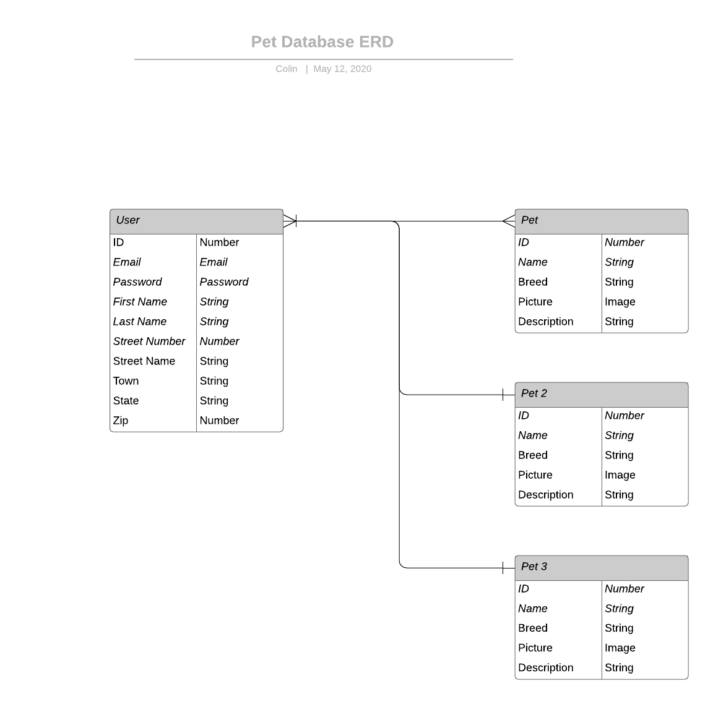

#### Wireframe:
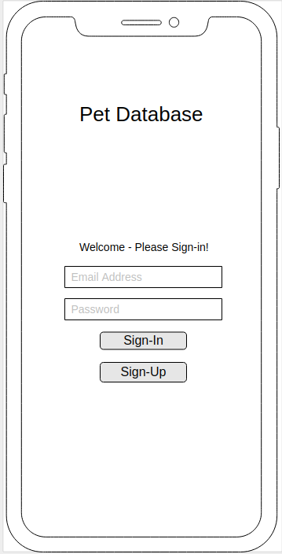
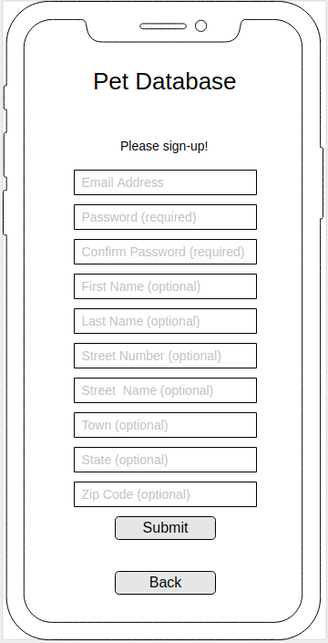
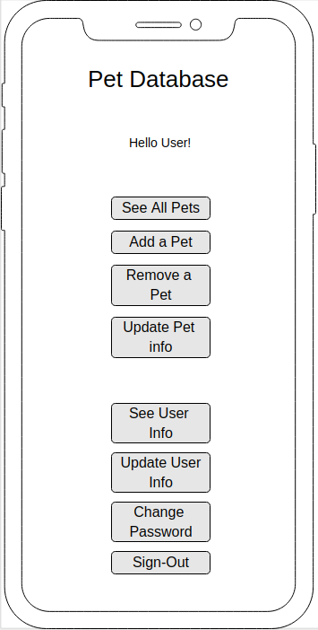
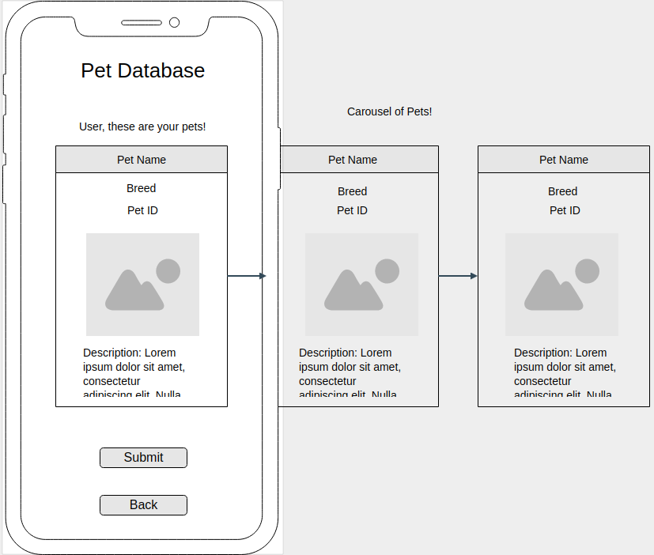
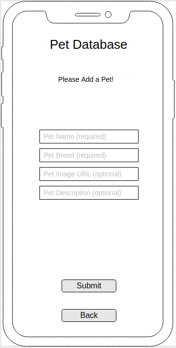
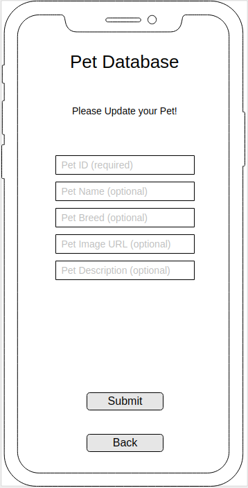
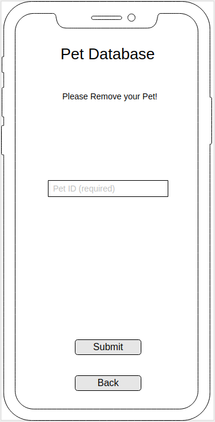
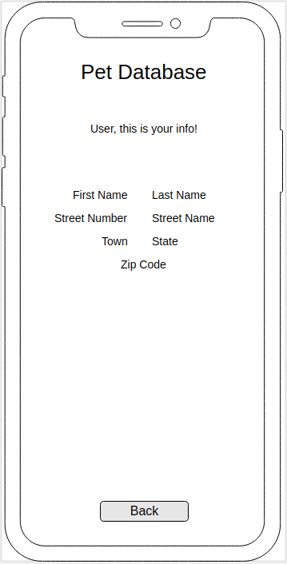
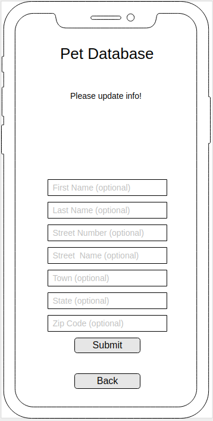
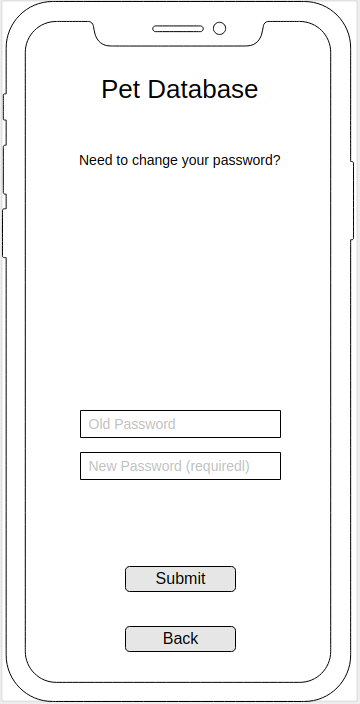
